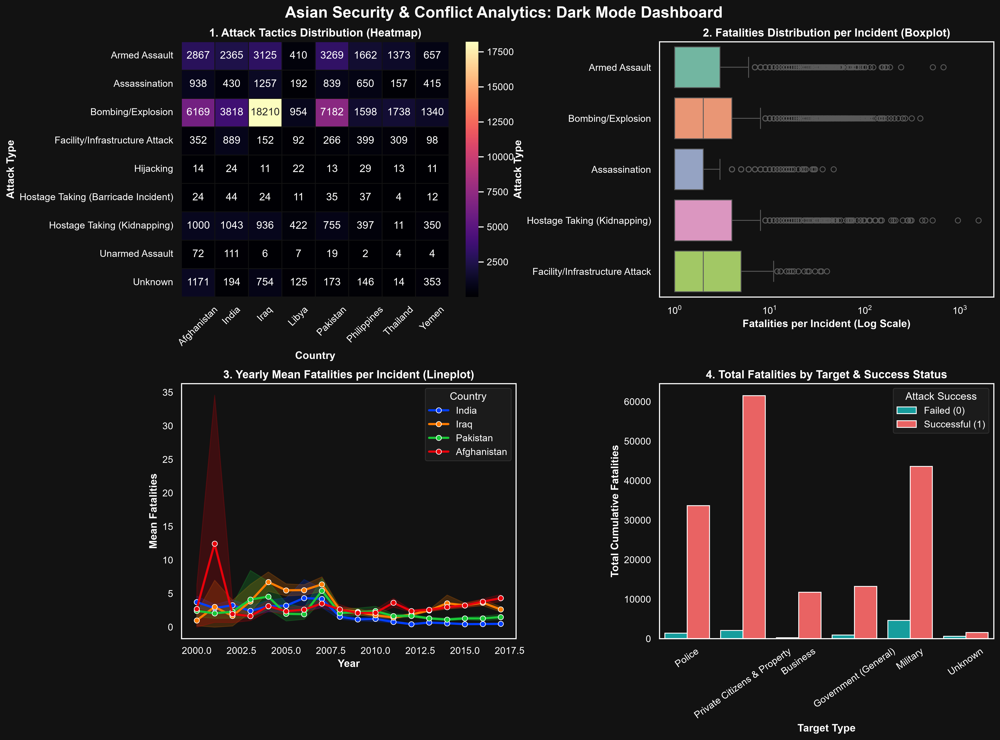

# 🎨 Seaborn Data Visualization & Dark Analytics Dashboard

A hands-on repository demonstrating exploratory data analysis (EDA) and statistical visualization using **Seaborn**, **Pandas**, **NumPy**, and **Matplotlib**.

This repository covers core Seaborn plotting paradigms—from custom styling and distributions to multi-variable grid layouts—culminating in a publication-quality **4-panel Dark Mode Capstone Dashboard** analyzing over 111,000 records from the **Global Terrorism Database (GTD)**.

---

## 📸 Dark Mode Capstone Dashboard Preview



---

## 📚 Topics Mastered

| Topic | Key Concepts & Functions Learned |
| :--- | :--- |
| **Intro & Environment Setup** | Library installation, environment architecture, and integration with `matplotlib.pyplot`, `pandas`, and `numpy`. |
| **Themes & Color Palettes** | Configuring background styles (`sns.set_theme`), global `rc` parameters for dark mode, and applying continuous/categorical colormaps (`magma`, `Set2`, `bright`). |
| **Loading Datasets** | Ingesting online Seaborn sample datasets (`sns.load_dataset`) and processing custom local CSV DataFrames. |
| **Relational Plots** | Mapping bivariate relationships using `sns.scatterplot()` and time-series trends with `sns.lineplot()` (including shaded confidence interval bands). |
| **Distribution Plots** | Visualizing continuous density, frequency distributions, and kernel estimates using `sns.histplot()` and `sns.kdeplot()`. |
| **Categorical Plots** | Comparing metrics across discrete groups using `sns.boxplot()` (with log-scale axes), `sns.barplot()` (with custom estimators), and `sns.swarmplot()`. |
| **Jointplot & Pairplot** | Bivariate scatter analyses with marginal distribution distributions via `sns.jointplot()` and multi-variable pairwise grids via `sns.pairplot()`. |

---

## 🎯 Capstone Project Features & Architecture

The final project combines all Seaborn concepts into a high-contrast **2x2 Dark Mode Dashboard**:

1. **Attack Tactics Heatmap (`sns.heatmap`)**
   * Computes a frequency cross-tabulation matrix of attack types across top Asian nations using `pd.crosstab()`.
   * Custom dark styling applied using the `magma` colormap and explicit colorbar tick configurations.
2. **Fatality Distribution Boxplot (`sns.boxplot`)**
   * Displays fatality spreads per incident across top attack tactics.
   * Utilizes a logarithmic X-axis scale (`set_xscale('log')`) to cleanly render extreme statistical outliers.
3. **Yearly Mean Fatalities Trend (`sns.lineplot`)**
   * Tracks time-series fatality averages from 2000 to 2017 for key regional nations.
   * Leverages Seaborn's automatic bootstrapping to display confidence interval error bands.
4. **Target Impact Bar Chart (`sns.barplot`)**
   * Groups cumulative fatalities across target categories segmented by attack outcome status (`hue='success'`).
   * Custom high-contrast accent palette applied for instant visual contrast.

---

## 🚀 Quickstart

### 1. Clone the repository
```bash
git clone [https://github.com/YOUR_USERNAME/seaborn-data-visualization.git](https://github.com/YOUR_USERNAME/seaborn-data-visualization.git)
cd seaborn-data-visualization
